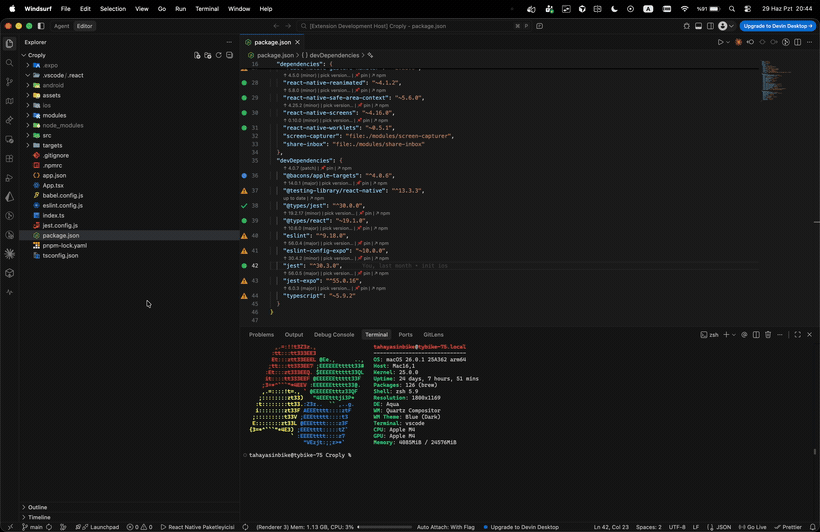

<div align="center">

# 📦 Dependency Version Checker

### Whatever the project — see your dependencies, understand them, update with confidence.

For **npm · Python · Rust · PHP** projects: spot outdated packages at a glance, instantly tell a `major` from a `minor` or `patch`, and update one by one or in bulk — without peer-dependency surprises.




</div>

---

## ✨ Why this extension?

Keeping dependencies up to date is tedious and risky: which package is outdated? Is this update a **breaking major** or a safe **patch**? Will a bulk update blow up peer dependencies? What if I accidentally bump that one sensitive package?

**Dependency Version Checker** solves all of this in a single, smart panel:

- 🎯 **The right "latest"** — uses the registry's official `latest` tag; hides fake/canary versions like `1000.0.0` and pre-releases (alpha/beta) by default.
- 🌈 **Color-coded risk** — every update is marked `major` (red), `minor` (green), or `patch` (blue).
- ☑️ **Bulk or one-by-one** — tick a checkbox, pick any version from the dropdown, update in one click.
- 🛡️ **Peer-dependency protection** — catches incompatibilities before a bulk update and offers an automatic fix.
- 📌 **Version pinning with notes** — lock sensitive packages, document *why* with a note, and share both across your team via git.
- 🔗 **Jump to the registry** — open any package's npm / PyPI / crates.io / Packagist page to read its docs in one click.

---

## 🌍 Supported ecosystems

| Ecosystem | Manifest | Installed version source | Registry |
|:--|:--|:--|:--|
| **npm** | `package.json` | `node_modules` · `package-lock.json` | registry.npmjs.org |
| **Python** | `requirements.txt` · `pyproject.toml` | pinned version | pypi.org |
| **Rust** | `Cargo.toml` | `Cargo.lock` | crates.io |
| **PHP** | `composer.json` | `composer.lock` | repo.packagist.org |

> Multiple projects and languages in a single workspace are scanned at once — each manifest gets its own group.

---

## 🖥️ Two interfaces, one experience

### 1. Side panel (Activity Bar)

A rich panel with its own icon:

- Each dependency on one row: **Package · Current · Target version · Type**
- **Checkbox** on the left, **version dropdown** on the right — no waiting, no hovering.
- **Search**, **Select all**, and **Update Selected** at the top.
- Color-coded badges, subtle zebra rows, native theme support (light/dark).

```
DEPENDENCIES                                    ⬆ ⟳
┌──────────────────────────────────────────────────┐
│ 🔍 Search package…                                 │
│ [ Update Selected (3) ]   ☐ Select all             │
├──────────────────────────────────────────────────┤
│ PACKAGE          CURRENT     TARGET          TYPE  │
│ ☑ react          19.1.0  →  [19.2.7    ▾]   minor  │
│ ☑ axios           1.4.0  →  [1.7.2     ▾]   minor  │
│ ☐ eslint          9.3.9  →  [10.6.0    ▾]   major  │
│ 📌 typescript      5.9.2  →  (pinned)             │
└──────────────────────────────────────────────────┘
```

### 2. Inline (CodeLens)

Open `package.json`, `Cargo.toml`, `requirements.txt`… and above each dependency line you get clear status + actions:

```
  🟢 ↑ 19.2.7 (minor)   │   pick version…   │   ↗ npm   │   📌 pin
"react": "^19.1.0",
```

Up-to-date packages show **✅ up to date**, so you can read the health of a manifest right where you edit it.

---

## 🧠 Smart features

### 🚦 At-a-glance status indicators
Both inline and in the panel, the risk of each dependency is obvious:

| Indicator | Meaning |
|:--|:--|
| ✅ | Up to date |
| 🔵 patch | Safe bug-fix update available |
| 🟢 minor | Backward-compatible feature update |
| ❗ major | Potentially breaking update |

### 🔽 Every version, with meaningful labels
The dropdown doesn't only list upgrades — it also lists **versions below the current one**, for when you need to roll back. Each version is labeled:

| Label | Meaning |
|:--|:--|
| `19.2.7 (major/minor/patch)` | Upgrade — with its risk level |
| `19.1.0 (current)` | What's installed right now |
| `18.3.1 (down)` | Older than current — a rollback |
| `17.0.0 (down, deprecated)` | Deprecated — flagged in orange |

### 🔗 Open the package's registry page
Click the ↗ link next to a package (panel or CodeLens) to jump straight to its **npm / PyPI / crates.io / Packagist** page — perfect for a quick look at the docs, changelog, or repository.

### 🛡️ Peer-dependency conflict check
Before a bulk update, the **peer requirements** of your chosen target versions are fetched from the registry and compared against the rest of your project. If there's a conflict, you're warned *before* anything is applied:

> ⚠️ `@react-navigation/native-stack@7.17.6` requires `@react-navigation/native "^7.3.4"` (current `7.2.2`)
>
> **[ Auto-fix & update ]** also bumps the conflicting package to the lowest compatible version — `ERESOLVE` errors become a thing of the past.

### 📌 Version pinning — with notes, shared with your team
Lock a sensitive package with 📌: its **checkbox is removed, its dropdown disabled**, and "Select all" plus bulk updates **skip it**. Accidental updates become impossible.

Click the **ⓘ** icon next to a pinned package to add a **reason** — *why* is this version frozen? Hover the icon to read the note anytime; in CodeLens it shows as `📝 your note`.

Pins **and their notes** are written to `.vscode/dep-version-checker.json` using **project-relative paths** — commit it to git and **your whole team sees the same pins and reasons**. When a teammate pulls, the panel updates automatically.

```json
{
  "pins": ["package.json::devDependencies::typescript"],
  "notes": {
    "package.json::devDependencies::typescript": "6.x breaks library X — frozen until resolved"
  }
}
```

### 🔧 Package-manager auto-detection
After an update it runs the right command: it inspects the lock file and picks between **npm / pnpm / yarn / bun**. The range prefix in your manifest (`^`, `~`) is preserved.

### ♻️ Automatic re-scan
When installation finishes and the lock file (`pnpm-lock.yaml`, `package-lock.json`, `Cargo.lock`…) changes, the panel **refreshes itself** and verifies against the real installed version.

---

## 🚀 Quick start

1. Click the **Dependencies** icon in the Activity Bar.
2. Your workspace is scanned automatically; dependencies are listed in groups.
3. **Tick** the ones you want, pick a **target version** from the dropdown.
4. **Update Selected** → the manifest is updated and your package manager runs in the integrated terminal.

---

## ⚙️ Settings

| Setting | Default | Description |
|:--|:--|:--|
| `depChecker.includePrerelease` | `false` | Also consider alpha/beta/rc versions |
| `depChecker.runInstallAfterUpdate` | `true` | Run the install command in the terminal after an update |
| `depChecker.npmPeerConflictStrategy` | `default` | `legacy-peer-deps` / `force` — strategy for npm peer conflicts |
| `depChecker.requestTimeoutMs` | `8000` | Registry request timeout (ms) |

---

## 🔒 Privacy

The extension only makes requests to **public package registries** (npmjs, PyPI, crates.io, Packagist) to fetch version info. Your code, credentials, and any other data are never sent anywhere.

---

## 💬 Feedback

Suggestions and bug reports are very welcome — keep your dependencies fresh and safe! 🌱

<div align="center">

**MIT License** · Happy coding

</div>
